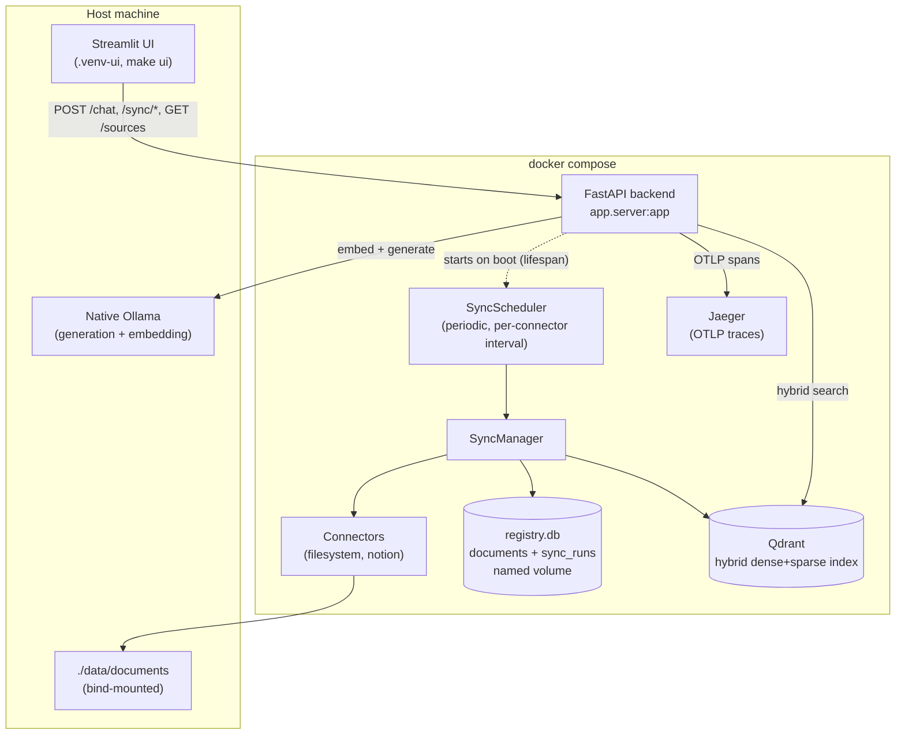

# Knowledge Base RAG

Multi-source knowledge base RAG platform with automatic incremental sync.

Builds on [production-rag-platform](https://github.com/negativexq/production-rag-platform)'s
proven core pipeline (chunking, hybrid dense+sparse search, cross-encoder
reranking, grounded generation with citations, OpenTelemetry tracing) rather
than rewriting it from scratch. The new value-add here: ingesting multiple
document types (PDF, Markdown, web pages, Notion, Confluence) through a
shared `Connector` interface, and automatic incremental re-sync — only
changed content gets re-indexed.

Full sprint-by-sprint plan: [docs/PLANNING.md](docs/PLANNING.md).

## Status

**Sprints 0–11** are complete: foundation + core pipeline port, LLM provider
abstraction (Ollama + Claude), a SQLite-backed document registry, a
filesystem `Connector` that ingests mixed PDF/Markdown folders, hash-based
incremental sync (skip unchanged, update changed, delete vanished — no
orphan chunks), end-to-end proof that citations can't leak across
documents that collide on location, a web page parser (trafilatura), the
first remote connector (`NotionConnector`), a sync scheduler (periodic +
manual "sync now" via a FastAPI endpoint, with sync history and
overlap-safe concurrent-sync handling), full tracing across the sync
pipeline — a real sync run is one Jaeger trace end to end, verified
against a real local Jaeger — a golden-set evaluation harness (DeepEval +
a local `qwen2.5:7b-instruct` judge, `python -m app.evaluation.cli
--golden-set <path>`) reporting retrieval and generation metrics broken
down by content format (PDF vs. Markdown), a multi-page Streamlit UI
(Chat with streaming/citations/a live Jaeger pipeline-trace panel,
Sources, Sync Status), and a one-command Docker Compose setup — Qdrant +
Jaeger + the backend all run in containers (Ollama stays native), the
document registry and sync history survive a container restart (a real
named volume, not assumed), and the periodic sync scheduler actually
starts on container boot (wired into FastAPI's lifespan, verified with a
real short-interval run, not just code review). See `docs/PLANNING.md`'s
closing notes and the `docs/sprint-0{0..4,6,7,8,9,10,11}-plan.md` files
for the design decisions behind each (Sprint 5 was verification-only, no
new plan doc — see its closing note). **Notion has not been tested
against a real workspace** on this machine (no `NOTION_API_KEY`), and the
evaluation golden set correspondingly has no Notion questions — see the
Sprint 6 and Sprint 9 closing notes.

## Architecture



## Quick start (Docker Compose)

Requires a native [Ollama](https://ollama.com) install — Docker Desktop on
macOS has no Metal GPU passthrough, so Ollama runs on the host and the
backend container reaches it via `host.docker.internal`, not in a
container.

```bash
ollama pull qwen2.5:7b-instruct
ollama pull nomic-embed-text
docker compose up -d --build   # Qdrant + Jaeger + backend
```

`NOTION_API_KEY` is optional — set it in a repo-root `.env` (read by
Docker Compose for variable substitution) before `up` only if the Notion
connector should actually run; leave it unset and `filesystem` is the only
active connector, same as running on bare Python.

Drop real files into `./data/documents/` (bind-mounted into the
container), then either wait for the next scheduled sync or trigger one
now:

```bash
curl -X POST http://localhost:8000/sync/filesystem
curl http://localhost:8000/health/ollama   # proves the container can reach native Ollama
```

The registry/sync-history SQLite file lives in a named volume
(`registry_data`) — it survives `docker compose restart`/`stop`+`start`;
only `docker compose down -v` wipes it (genuinely fresh install).

## LLM providers

Generation (chat) and embedding are independent, config-driven choices —
Claude has no embedding endpoint, so embedding always stays on Ollama
regardless of which chat provider is selected:

```bash
GENERATION_PROVIDER=ollama   # or claude — local-first default
EMBEDDING_PROVIDER=ollama    # only option today
CLAUDE_API_KEY=sk-ant-...    # required if GENERATION_PROVIDER=claude
```

## Connectors

Two `Connector` implementations exist: `LocalFilesystemConnector`
(PDF/Markdown from a local folder) and `NotionConnector` (real Notion API
calls — search + block-children endpoints, with 429 retry/backoff; needs
`NOTION_API_KEY`). Both go through the same `ingest_connector()` incremental
sync pipeline (skip/update/delete), unmodified.

## Sync

Each connector syncs on its own interval (`FILESYSTEM_SYNC_INTERVAL_SECONDS`,
`NOTION_SYNC_INTERVAL_SECONDS`), plus a manual trigger:

```bash
curl -X POST http://localhost:8000/sync/filesystem
curl http://localhost:8000/sync/filesystem/history
```

Two syncs of the *same* connector never run concurrently — a second
attempt while one is in progress is rejected immediately (`409`), not
queued. Every run (scheduled or manual) is recorded with its outcome,
duration, and how many documents changed/were skipped/deleted.

## Citation format

Citations are multi-source from the start:

```
[s.<source_type>:<source_id>/<location>]
examples: [s.filesystem:handbook_pdf/2/0]           (PDF: page/paragraph)
          [s.filesystem:readme_md/Kurulum/Adım 1]   (Markdown: heading path)
```

`source_type` identifies the connector a document came from (`filesystem`
today; `notion`/`confluence` later), not its file format — the same
connector can ingest multiple formats. Grounding is checked against the
full `(source_type, source_id, location)` triple, so two different sources
can safely share the same location without one masquerading as the other.

## UI

A multi-page Streamlit UI (Chat, Sources, Sync Status) runs in its own
venv (`.venv-ui`) — `streamlit==1.61.1` and this project's `fastapi==0.115.6`
pin have a real, unresolvable `starlette` version conflict (confirmed via
`pip install`, see the Sprint 10 closing note), so the UI can't share the
backend's venv:

```bash
python3.12 -m venv .venv-ui
.venv-ui/bin/pip install -r requirements-ui.txt
make ui    # streamlit — points at BACKEND_URL (default http://localhost:8000)
```

It works against either backend: the containerized one (`docker compose up`,
above) or a host-run one (`make dev`, below) — it's a pure HTTP client,
never importing backend code directly, only `POST /chat`, `GET/POST
/sync/...`, `GET /sources`, and Jaeger's own HTTP API.

## Development setup (host venv, for running tests)

Requires Python 3.11+ and a native [Ollama](https://ollama.com) install
(same host-only reasoning as the Docker Compose setup above).

```bash
python3.12 -m venv .venv
.venv/bin/pip install -r requirements-dev.txt
docker compose up -d qdrant jaeger   # just the two stateless services
ollama pull qwen2.5:7b-instruct
ollama pull nomic-embed-text
make dev   # real backend on the host: uvicorn app.server:app --reload
```

Run the test suite:

```bash
make test
```

Tests that require live Ollama/Qdrant skip automatically when those
services aren't reachable.

## License

MIT — see [LICENSE](LICENSE).
