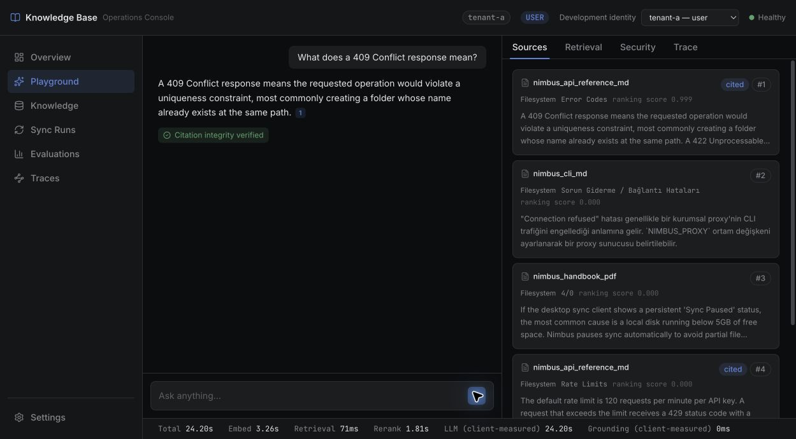
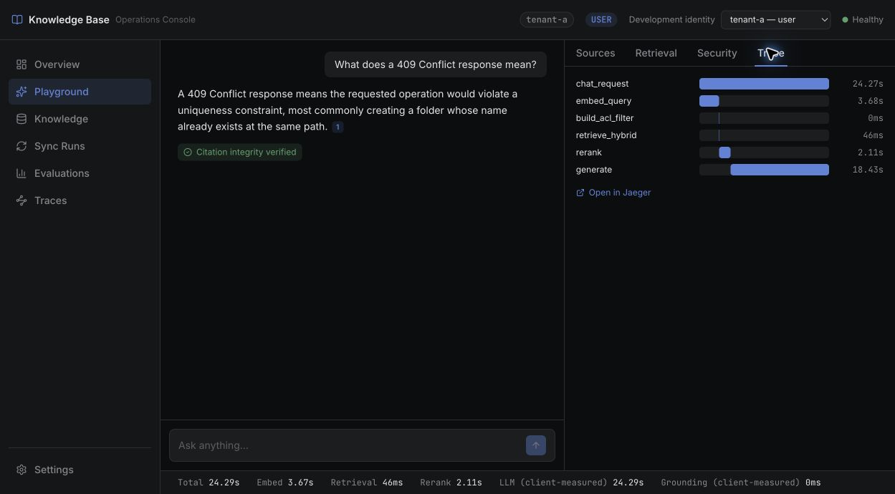
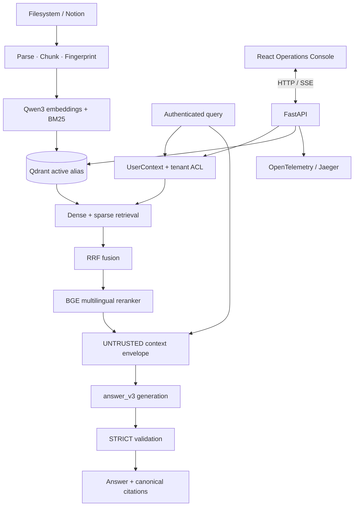
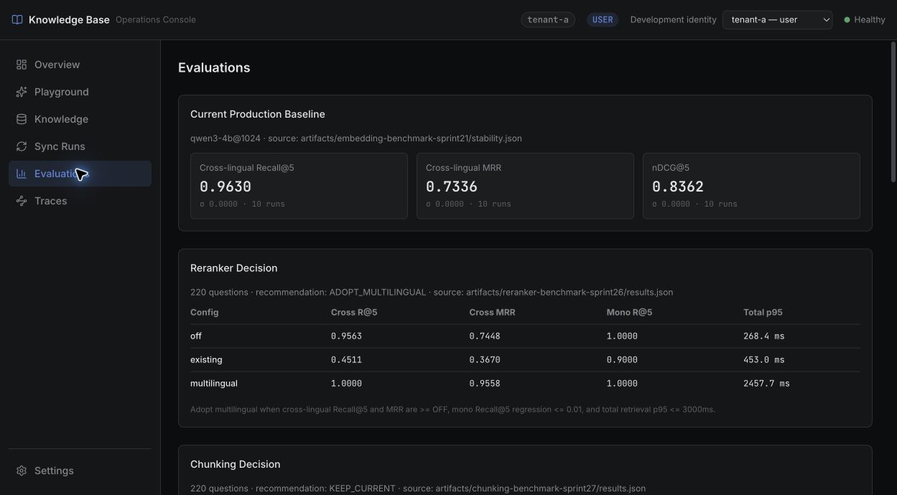

# Knowledge Base RAG

Knowledge Base RAG is a local-first, production-oriented platform for
multilingual knowledge bases. It combines tenant-scoped hybrid retrieval,
measured reranking, citation-aware generation, prompt-injection resistance,
incremental synchronization, and an operations console for inspecting what the
system retrieved and why.

This is an engineering system for operating and evaluating RAG—not a ChatGPT
clone. The UI makes the retrieval evidence, security context, validation state,
and trace waterfall visible instead of hiding them behind a chat transcript.





## Why this project

Most RAG demos stop at “retrieve a few chunks and ask a model.” This project
focuses on the boundaries that decide whether that demo is useful in practice:

- retrieval is restricted by server-owned tenant and role context;
- dense and sparse signals are fused before multilingual reranking;
- retrieved text and metadata remain explicitly untrusted reference data;
- citations are canonicalized and checked against the authorized result set;
- production generation defaults to buffer → validate → release;
- sync, index activation, evaluation, and trace state are inspectable.

## Key capabilities

- Multilingual hybrid retrieval with Qwen3-Embedding-4B at 1024 dimensions,
  Qdrant BM25 sparse search, and reciprocal rank fusion.
- `BAAI/bge-reranker-v2-m3` multilingual reranking over 20 candidates, with 5
  results passed onward to generation.
- Mandatory tenant ACL enforcement before reranking or generation, with
  `USER`, `OPERATOR`, and `ADMIN` role boundaries.
- Untrusted RAG context serialization, `answer_v3`, canonical citation
  validation, and deterministic output-policy checks.
- Strict production validation with an explicit fast streaming mode for
  latency-sensitive development paths.
- Incremental sync and reconciliation with content fingerprints, versioned
  Qdrant collections, alias activation, deferred cleanup, and rollback-aware
  index lifecycle.
- OpenTelemetry traces and Jaeger-backed visibility for sync and chat flows.
- A React RAG Operations Console for evidence inspection, evaluation results,
  tenant-scoped knowledge, sync history, settings, and traces.

## Architecture



FastAPI owns authentication, authorization, tenant scoping, retrieval,
generation, SSE production, and read-only `/ui/*` aggregation. Qdrant stores
the active index, Ollama provides local embedding and generation inference, and
Jaeger stores trace spans. The React client owns presentation state and
client-observed timings; it is not an authorization boundary.

See [the architecture deep dive](docs/architecture.md) for the control-plane
and data-plane details.

## Retrieval pipeline

The production query path is:

```text
authenticated request
  → server-owned UserContext / RetrievalContext
  → mandatory tenant ACL
  → Qwen3-Embedding-4B @ 1024 dense query embedding
  → Qdrant dense + BM25 sparse retrieval
  → reciprocal rank fusion
  → BAAI/bge-reranker-v2-m3
  → top 5 authorized results
  → untrusted generation context
```

The reranker receives 20 authorized candidates and returns the top 5. The
reranker cannot widen the ACL-filtered set. Production currently retains the
legacy 500/50 whitespace-word chunking baseline: token-aware variants were
structurally correct but did not produce a measurable quality or efficiency
advantage on the current short fixture corpus. The implementation and the
decision evidence are documented in [docs/chunking.md](docs/chunking.md).

The active Qdrant collection is served through the `kb_active` alias. Pipeline
fingerprints include the embedding, parser, index, and chunk configuration so a
configuration mismatch is surfaced instead of silently serving an incompatible
index.

## Security model

There are two distinct security questions:

| Boundary | Question | Enforcement |
| --- | --- | --- |
| Access control | Can this user retrieve this chunk? | Server-owned identity, role checks, and mandatory tenant ACL before reranking |
| Prompt trust | If an authorized chunk contains instructions, should the model obey them? | Untrusted context envelope, `answer_v3`, canonical citation checks, and output validation |

Document body, title, heading, source name, and location metadata are serialized
as untrusted data. They never become provider `system` or `assistant` messages;
delimiter-looking text inside a document cannot change the message role.

The default security validation mode is `strict`: the answer is buffered,
validated, and released only if citation and output-policy checks pass. `fast`
is an explicit server-side opt-in that streams immediately and performs a
post-stream check; output may reach the client before a violation is detected.
The frontend cannot downgrade the server-owned mode.

Authentication is environment-scoped: `APP_ENV=development` with an empty
`AUTH_TOKENS_JSON` enables the documented demo identities. In
`APP_ENV=production`, explicit credentials/verifier configuration is required;
the demo token fallback and `AUTH_ENABLED=false` are rejected at startup.

This design is tested against the documented adversarial suite; it is not a
claim of universal prompt-injection immunity. Citation integrity is also not
claim-level semantic grounding. See [docs/security.md](docs/security.md).

## Evaluation and benchmark highlights

The README reports current decisions; detailed runs and per-query evidence
remain in [artifacts/](artifacts/) and the linked deep dives.

The next benchmark preparation set is documented in [Evaluation Corpus v2](docs/evaluation-dataset.md); it is a frozen, model-free fixture expansion and has not been benchmarked yet.

### Answerability evaluation

Phase 6 evaluated retrieval-derived gates, statistical calibration, and
semantic ambiguity/evidence-sufficiency designs. The experiments remain
research/shadow-only: no answerability gate was promoted to the active runtime.
The final decision is documented in [docs/phase-6-answerability-decision.md](docs/phase-6-answerability-decision.md), with raw runs indexed in [artifacts/phase-6/README.md](artifacts/phase-6/README.md).

The detailed semantic evaluator history remains available in [docs/phase-6c-semantic-answerability.md](docs/phase-6c-semantic-answerability.md).
The cache-first local evaluator model smoke is documented in [docs/phase-6c1-semantic-model-smoke.md](docs/phase-6c1-semantic-model-smoke.md); it does not enable runtime gating.
The balanced qwen3.5:4b validation smoke is documented in [docs/phase-6c2-balanced-semantic-smoke.md](docs/phase-6c2-balanced-semantic-smoke.md).
The scope/authority ambiguity-v2 comparison is documented in [docs/phase-6c3-ambiguity-v2.md](docs/phase-6c3-ambiguity-v2.md); it remains experimental and shadow-only.

The query-scope boundary comparison is documented in [docs/phase-6c4-query-scope-boundary.md](docs/phase-6c4-query-scope-boundary.md); it is offline and shadow-only.

The obligation-based sufficiency experiment is documented in [docs/phase-6c5-obligation-sufficiency.md](docs/phase-6c5-obligation-sufficiency.md); it remains experimental and does not change runtime gating.

The fixed-obligation support follow-up is documented in [docs/phase-6c6-fixed-obligation-support.md](docs/phase-6c6-fixed-obligation-support.md); extraction and support remain experimental and do not change runtime gating.

| Layer | Active decision | Evidence |
| --- | --- | --- |
| Embeddings | Qwen3-Embedding-4B @ 1024 | [Multilingual embedding benchmark](artifacts/embedding-benchmark-sprint21/stability.json) and migration artifacts |
| Retrieval | Dense + BM25 + RRF | [220-query multilingual evaluation set](artifacts/reranker-benchmark-sprint26/results.json) |
| Reranker | `BAAI/bge-reranker-v2-m3` | Cross-lingual Recall@5 `1.0000`, MRR `0.9558`; 63 rescues, 0 drops ([results](artifacts/reranker-benchmark-sprint26/results.json)) |
| Chunking | Legacy 500/50 baseline retained | Token-aware candidates matched quality but did not reduce context, chunk count, or storage on the current corpus |
| Prompt security | Tenant ACL + untrusted context + STRICT | 82 adversarial cases; injection, spoofing, suppression, unauthorized citation, and cross-tenant exfiltration rates all `0.0000` ([results](artifacts/security-sprint25/adversarial-results.json)) |
| Generation sanity | Baseline generation path retained | 26/26 successful; citation integrity, not-found behavior, and strict validation all `1.0000` ([results](artifacts/chunking-benchmark-sprint27/generation-sanity.json)) |

The reranker benchmark measured cross-lingual Recall@5 of `1.0000` for the
selected model versus `0.9563` with reranking disabled. The multilingual model
has a meaningful local CPU latency cost; see [docs/reranking.md](docs/reranking.md)
for the full trade-off and paired comparison.

The chunking corpus is intentionally called out as a limitation: its average
chunk is about 69 Qwen tokens and its maximum is 100, so the 256–768 token
candidate boundaries were not exercised. See [docs/chunking.md](docs/chunking.md)
for corrected latency measurements and the KEEP_CURRENT decision.

## RAG Operations Console

The React console is an operations and debugging surface, not a conversational
product shell. It exposes:

- **Overview** — active index, source health, recent syncs, and security state.
- **Playground** — streamed answer, canonical citations, Sources, Retrieval,
  Security, and Trace inspectors.
- **Knowledge** — tenant-scoped source and document metadata.
- **Sync Runs** — role-aware sync actions and history.
- **Evaluations** — retrieval, reranker, chunking, prompt-security, and
  generation-sanity results from real artifacts.
- **Traces** — sync trace summaries and links to the Jaeger-backed flow.
- **Settings** — active embedding, reranker, chunking, generation, prompt, and
  validation configuration.

The development identity selector is explicitly local/demo authentication UX.
The backend remains the enforcement point for bearer-token identity, tenant ACL,
roles, and sync permissions. Local storage of the selected demo token is not a
production authentication design.



For the remaining real UI captures—including Retrieval, Security, and the
scrolled Settings sections—see the [complete screenshot asset set](docs/assets/).

## Quick start

### Prerequisites

- Python 3.11 or newer
- Docker Desktop or a compatible Docker Engine
- Node.js 22 and npm for the React console
- Native [Ollama](https://ollama.com) on the host
- Enough local disk/RAM for Qwen3-Embedding-4B and the configured generation
  model

### Run the stack

```bash
cp .env.example .env

# Ollama runs natively on the host.
ollama pull qwen3-embedding:4b
ollama pull qwen3.5:4b

# Qdrant, Jaeger, and the FastAPI service.
docker compose up -d --build

# React Operations Console.
cd frontend
npm ci
npm run dev
```

Open `http://localhost:5173`. The local compose setup expects Ollama at
`host.docker.internal:11434`; the backend serves on port `8000`, Qdrant on
`6333`, and Jaeger on `16686`. A fresh installation must ingest configured
documents before retrieval can return evidence. Sync can be triggered from the
console with an `OPERATOR` identity or through the protected sync API.

For host-native backend development, run Qdrant and Jaeger with
`docker compose up -d qdrant jaeger`, then use `make dev` and run the frontend
separately. The exact environment surface is in [.env.example](.env.example);
it contains placeholders only.

## Configuration

The most important server-owned settings are:

| Area | Current setting |
| --- | --- |
| Embedding | `EMBEDDING_MODEL_KEY=qwen3-4b`, `EMBEDDING_OUTPUT_DIMENSION=1024` |
| Retrieval | Qdrant `kb_active`, BM25 sparse, RRF |
| Reranking | `DEV_FAST`: `15 → 5`; global/reference: `20 → 5`, `BAAI/bge-reranker-v2-m3` |
| Chunking | `CHUNKING_MODE=baseline`, legacy 500/50 production baseline |
| Generation | `DEV_FAST`: Ollama `qwen3.5:4b`, `think=false` |
| Prompt/security | `ACTIVE_PROMPT_VERSION=v3`, `SECURITY_VALIDATION_MODE=strict` |
| Auth/CORS | `APP_ENV=development`, `AUTH_ENABLED=true`, explicit `CORS_ORIGINS` allow-list |

Do not change model, dimension, or chunk settings without activating a matching
indexed collection. See [docs/embedding-migration.md](docs/embedding-migration.md)
for the versioned index procedure.

## Testing

Backend checks:

```bash
pytest
ruff check app tests scripts
```

Frontend checks:

```bash
cd frontend
npm test
npm run typecheck
npm run lint
npm run build
```

The last full verification recorded 859 backend tests passed, 2 skipped
(external credential checks), 18 frontend tests passed, and green
typecheck, lint, build, and Ruff gates.

## Project structure

```text
app/          FastAPI APIs, retrieval, security, sync, LLM wiring
frontend/     React Operations Console
prompts/      Versioned generation policies
tests/        Backend and frontend regression coverage
docs/         Architecture, security, benchmark deep dives, and history
artifacts/    Machine-readable benchmark and evaluation evidence
```

## Engineering deep dives

- [Architecture](docs/architecture.md) — UI/API/data-plane boundaries and
  read-only UI aggregation.
- [Security model](docs/security.md) — authentication, tenant ACL, untrusted
  context, citations, and strict/fast semantics.
- [Reranking decision](docs/reranking.md) — model choice, paired metrics,
  cross-lingual lift, and latency cost.
- [Chunking decision](docs/chunking.md) — tokenizer-aware implementation,
  context efficiency, boundary checks, and the current production decision.
- [Evaluation Corpus v2](docs/evaluation-dataset.md) — corpus design, golden
  schema, frozen splits, static validation, and the next-run manifest.
- [Phase 6A answerability shadow features](docs/phase-6a-answerability.md) —
  deterministic post-retrieval signals without thresholds or abstention.
- [Phase 6B answerability calibration](docs/phase-6b-answerability.md) —
  development-fit and calibration-confirmation evidence without a runtime gate.
- [Phase 5.5 runtime optimization](docs/phase-5-5-runtime-optimization.md) —
  local generation profile and guarded candidate-k sweep.
- [Embedding migration](docs/embedding-migration.md) — model/index lifecycle,
  fingerprinting, activation, and rollback.
- [Architecture decisions](docs/adr/README.md) — focused design records.
- [Engineering history](docs/PLANNING.md) — development log and roadmap.

## Phase 7 closure

Phase 7 corrected the original source-level evidence metric: source presence
was not treated as fact presence. Fact-level annotations showed that BGE Top-5
could omit a fact-bearing passage even when the source was present, while the
section-aware evidence representation restored the authored facts with modest
context growth. Pipeline v2 then moved safety to deterministic
evidence-backed validation; its exact-quote binding remained brittle.

Pipeline v2.3 replaced copied quotes with support-unit IDs. Its initial paired
result looked mixed, but the final integrity audit found asymmetric execution
settings (`num_predict` was unset for historical V2.2 and 1024 for V2.3).
Under corrected symmetric execution, the evaluated V2.3 implementation was
not adopted: it produced no correctly attributed visible answers in the
corrected 40-run holdout and had higher false-abstention and latency. The
debug-set reproduction step was not run, so this does not disprove the
support-unit contract itself or resolve implementation-versus-contract
causality. No holdout-driven fix or additional architecture experiment was
opened.

The selected closure candidate is the corrected symmetric
`pipeline_v2_2_evidence_backed` configuration. Citation identity is
deterministic and tenant ACLs remain enforced, but semantic claim-to-evidence
alignment is not guaranteed: on the corrected holdout V2.2 had 15/40 correctly
attributed and 10/40 misattributed visible answers (40% of the
attributed/misattributed set).

This is not a guarantee of semantic attribution: citation identity is
deterministic, while the cited evidence may still be semantically misaligned
with a visible claim. Multi-document synthesis also remains a weak slice;
the final Smoke36 measured `1/3` fully correct multi-document queries. Both
limitations are carried into the frozen Development200 measurement plan.

The development split contained 12 multi-document queries. After the initial
eight holdout queries and three debug queries, only one eligible unseen query
remained, so the preregistered +8 extension was impossible without violating
the split policy. Calibration and frozen test were untouched.

Operationally, a stale Ollama llama-server runner state caused requests to
stall; model unload plus a controlled service restart restored inference
health. Constrained structured generation also showed output-length pathology
and severe V2.3 tail latency; bounding generation with `num_predict=1024`
stabilized execution without changing retrieval.

The Smoke36 audit keeps task completeness separate from safe behavior. The
four authored ambiguous queries have a `SHOULD_CLARIFY` target; their existing
`0/4 complete` score is therefore not a clarification score. The two
injection-bearing queries remain answerable: their `0/2` task-completeness
result is a genuine content result, while injection handling succeeded `2/2`
with zero injection failures. These behavioral slice metrics are additive and
do not overwrite the original Smoke36 numbers.

Smoke36 contains 36 official records from 37 transport attempts: one provider
generation completed, but a scorer failure occurred before atomic persistence;
the first raw output was not recoverable and provider failures remained zero.

Development200 characterization used the exact frozen V2.2 configuration
(`680ca44af8b296526bd22b7d81a5388c59132da4fd42ff4f4cb968c2b1c2158d`) with
200/200 persisted results and zero provider failures. It measured 72 raw and
72 visible fully correct answerable records, 56 forced abstentions, and 14
false abstentions. The multi-document slice was 5/12 fully correct; this is a
characterized weak slice, not a reason to reopen Phase 7 architecture work.

The frozen 30-query blind attribution sample produced 21 correctly attributed
and 3 misattributed visible factual answers, with 6 queries having no visible
factual claim. These sample results are characterization only and are not a
claim of general semantic attribution correctness. The corrected paired
holdout remains the stronger limitation signal: 15/40 correctly attributed
and 10/40 misattributed V2.2 visible answers (40% among those two classes).

Ambiguous behavior is tracked separately: all 12 development ambiguous
queries were authored to expect clarification; 0 clarified, 7 answered
without clarification, and 5 safely abstained (silent-interpretation rate
58.33%). Injection security handling succeeded 8/8, while task completeness
was 4/8. Generation latency was 29.4s p50, 84.6s p95, and 104.3s max.
Hard safety passed with zero unauthorized leakage, visible unsupported ACL
answers, security violations, injection safety failures, and critical-value
conflicts. Configuration was locked only after this gate; Calibration112 and
Frozen133 remain untouched.

## Current limitations

- BGE reranking runs in a worker thread from the async retrieval path; bounded
  multi-request serving remains a separate concern.
- The chunking benchmark corpus is too short to distinguish 256–768 token
  boundaries. Revisit it when substantially longer documents exercise those
  limits.
- Semantic answerability/abstention gates were evaluated in Phase 6 but were
  not promoted; the active runtime retains deterministic no-evidence safety
  and citation integrity, not a semantic gate. Claim-level semantic grounding
  is still not implemented.
- The local token authenticator and development identities are suitable for
  local/demo use. A production deployment should replace them with an
  appropriate identity provider or verifier.
- Sync coordination is process-local and the current connector model maps each
  configured source type to a server-owned tenant.

## Next

The next useful engineering step is end-to-end grounded generation quality
evaluation using the existing retrieval, ACL, reranker, and citation-safe
runtime path. Async/concurrent model serving remains a separate concern. The
complete roadmap and historical decisions remain in [docs/PLANNING.md](docs/PLANNING.md).

## License

See the repository license and notices for distribution terms.
