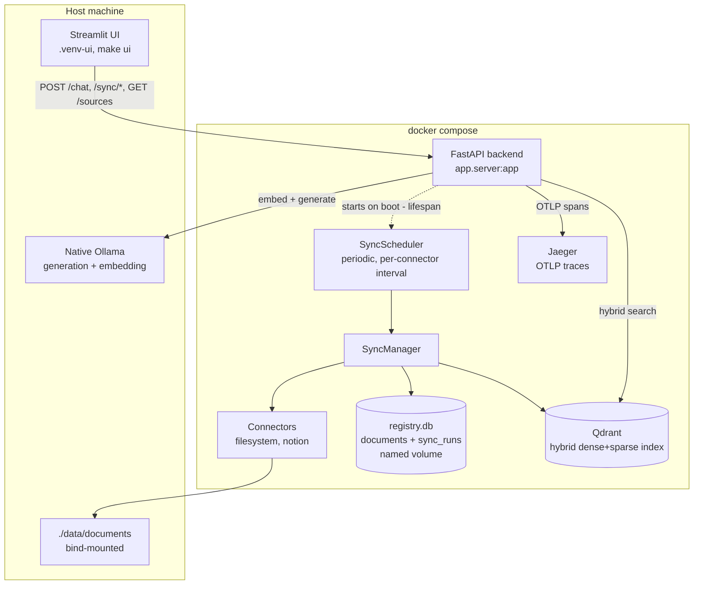

# Knowledge Base RAG

Multi-source knowledge base RAG platform with automatic incremental sync.

Builds on [production-rag-platform](https://github.com/negativexq/production-rag-platform)'s
proven core pipeline (chunking, hybrid dense+sparse search, cross-encoder
reranking, citation-aware generation, OpenTelemetry tracing) rather
than rewriting it from scratch. The new value-add here: ingesting multiple
document types (PDF, Markdown, Notion) through a shared `Connector`
interface — plus a standalone web-page parser (`app/parsing/web_parser.py`)
not yet wired into a connector, see [Known Limitations](#known-limitations)
— and automatic incremental re-sync: unchanged, healthy content is
skipped, and detected index drift (points missing, partially missing,
or orphaned in Qdrant) is automatically repaired rather than silently
trusted.

Full sprint-by-sprint plan: [docs/PLANNING.md](docs/PLANNING.md).

## Highlights

- **Multi-source ingestion** — filesystem (PDF/Markdown) and Notion behind
  one `Connector` interface, with hash-based incremental sync (skip
  unchanged, update changed, delete vanished — no orphan chunks)
- **Hybrid search** — dense + sparse (BM25) retrieval with native Qdrant
  RRF fusion, cross-encoder reranking
- **Source-scoped citation validation** — every citation is checked against
  the exact `(source_type, source_id, location)` it was generated from, so
  two different documents can never spoof each other's citations (proven
  with a dedicated cross-source-leak test, not just claimed) — this is
  citation *integrity*, not semantic grounding; see
  [Citation integrity validation, not semantic grounding](#citation-integrity-validation-not-semantic-grounding)
- **Full distributed tracing** — a sync run or a chat request is one
  Jaeger trace end to end, cross-checked span-by-span against Jaeger's own
  API, not just visually inspected
- **LLM-judged evaluation harness** — DeepEval + a local `qwen2.5:7b`
  judge, reporting retrieval/generation metrics broken down by content
  type from a real golden set
- **One-command deployment** — `docker compose up` brings up the full
  stack; sync history survives a container restart (a real named volume,
  verified, not assumed)
- **340+ tests**, almost all against real dependencies (real SQLite files,
  a real Qdrant instance, real Jaeger, real browser automation for the
  UI) rather than mocks — see [Known Limitations](#known-limitations) for
  what's honestly *not* covered yet

## Table of Contents

- [Status](#status)
- [Architecture](#architecture)
- [Beyond the Happy Path](#beyond-the-happy-path)
- [Technologies Used](#technologies-used)
- [Quick start (Docker Compose)](#quick-start-docker-compose)
- [LLM providers](#llm-providers)
- [Connectors](#connectors)
- [Sync](#sync)
- [Citation format](#citation-format)
- [UI](#ui)
- [Development setup](#development-setup-host-venv-for-running-tests)
- [Known Limitations](#known-limitations)
- [License](#license)

## Status

**Sprints 0–17 complete, including 17.1–17.4 hardening** — the platform
is fully working end to end:

- Core RAG pipeline (parsing, hybrid search, reranking, citation-aware
  generation) ported from production-rag-platform
- Multi-source ingestion: filesystem (PDF/Markdown) + Notion connectors
  behind a shared `Connector` interface
- Incremental sync (skip/update/delete by content hash) with a scheduler,
  manual trigger, and full history — including a zero-downtime versioned
  re-index with automatic rollback of a partially-written new version on
  mid-batch failure (see [Sync](#sync))
- Distributed tracing (OpenTelemetry + Jaeger) across both sync and chat
- Golden-set evaluation (DeepEval + a local judge model)
- A multi-page Streamlit UI (Chat, Sources, Sync Status)
- One-command Docker Compose deployment, with sync data surviving a
  container restart
- CI (lint + real-Qdrant test suite + Docker build) on every push

See [docs/PLANNING.md](docs/PLANNING.md) for the sprint-by-sprint closing
notes each of these is backed by, and **[Known Limitations](#known-limitations)**
below for what's *not* covered — most notably, the Notion connector has
never been tested against a real workspace (no API key available).

## Architecture



## Beyond the Happy Path

This section exists because "ingest a PDF, put it in Qdrant, ask an LLM"
is the easy 80%. Seven rounds of independent code review (Sprints 12,
16, 17, 17.1, 17.2, 17.3, 17.4) found real bugs in the other 20% — the
kind that only show up once a system has to survive its own edge cases,
not just its demo path. Each item below is a real bug, found and fixed,
not a hypothetical.

- **Point identity, not just point storage.** `QdrantStore.point_id_for`'s
  key was built from `doc_id` (a content hash) without `source_id` —
  two *different* documents with byte-identical content (e.g. a PDF
  duplicated under two filenames) silently collided on the same point
  ID, and the second upsert overwrote the first with no error. The
  review that found this also found the existing regression test was
  *itself* hiding the bug — a shared default in a test helper meant
  both "different" documents in the test were already colliding before
  the test's own assertions ever ran. Both the bug and the test that
  failed to catch it were fixed together (Sprint 17), with a new
  end-to-end test proving two identical-content files keep independent
  registry and Qdrant identity.
- **Versioned re-index with real cancellation safety.** A re-index
  embeds and upserts a document's new version *before* deleting the
  old one, so a failure mid-embed leaves the old version searchable
  instead of the document going dark (Sprint 13). A later review found
  that guarantee only held within a single batch — a multi-batch
  failure could leave a partial new version stranded forever — and
  that `asyncio.CancelledError` (a real app-shutdown or scheduler-stop
  signal) bypassed the rollback entirely, since it inherits from
  `BaseException`, not `Exception` (Sprint 16, Sprint 17). Both are
  proven with a real `task.cancel()` delivered mid-embed via
  `asyncio.Event`, not a manually-raised substitute standing in for one.
- **Registry and Qdrant are two separate stores that can drift apart —
  and now self-heal.** Incremental sync originally trusted a single
  signal: "has the content hash changed?" A review pointed out that
  Qdrant's data can disappear by means the app never sees (manual
  deletion, external tooling, partial data loss) while the registry's
  hash stays exactly the same, so a document could silently stay
  unsearchable forever. `QdrantStore.has_document_version()` and
  `count_for_document_version()` now reconcile the two on every sync
  (Sprint 17.2) — proven by deleting a document's Qdrant points
  directly, leaving the registry untouched, and watching the very next
  sync detect and repair it automatically, with no manual intervention.
- **A schema migration tested against the schema it actually has to
  migrate, not a simplified stand-in.** SQLite has no `ALTER COLUMN`
  to relax a `NOT NULL` constraint. A migration meant to make a
  `chunk_count` column nullable was validated against a fixture that
  simulated "the column doesn't exist yet" — but a real database from
  the previous sprint already had the column, as `NOT NULL DEFAULT 0`,
  so the migration was a silent no-op against it and could raise
  `sqlite3.IntegrityError` on a real upgrade. The fix was tested against
  a fixture that reproduces the *actual* prior schema byte-for-byte,
  confirmed to fail first, then rebuilds the table (SQLite's own
  workaround for the missing `ALTER COLUMN`) to genuinely drop the
  constraint (Sprint 17.4).
- **A recurring theme, not a one-off: green tests that hid real bugs.**
  This happened at least three separate times across the hardening
  sprints — the point-identity test above (Sprint 17), two Qdrant
  schema-validation tests that started passing for the wrong reason
  once a new check was added earlier in the same function, masking the
  dense-vector check they claimed to exercise (Sprint 17.1), and the
  migration test that only ever covered the easy case (Sprint 17.4).
  Each time, the fix wasn't just the code — it was proving the test
  would have failed *before* the fix, and rewriting the test alongside
  the bug.
- **In real numbers**: 426 tests (most against real dependencies — a
  real SQLite file, a real Qdrant instance, real Jaeger traces, real
  browser automation — not mocks), across seven independent review
  rounds. The embedding-concurrency default wasn't guessed: a real
  benchmark against native Ollama, later hardened with warmup runs,
  repeated samples, and randomized ordering after a review questioned
  the first pass's methodology, found `concurrency=4` (57.1 mean
  chunks/sec) and `concurrency=8` (55.6 mean chunks/sec) statistically
  indistinguishable — well within each other's measured variance — so
  4 stayed the default rather than doubling open connections for no
  measured gain.

## Technologies Used

Layer by layer, what's actually running (not aspirational — each line was
verified in a sprint closing note in [docs/PLANNING.md](docs/PLANNING.md)):

| Layer | Technology | Notes |
|---|---|---|
| Parsing | PyMuPDF (`fitz`) — PDF; hand-written heading-block parser — Markdown; `trafilatura` — web pages | Page/paragraph extraction ported from production-rag-platform (Sprint 0); Markdown's heading-path location scheme (Sprint 3) is reused by the web parser too (Sprint 6) |
| Chunking | Whitespace token counter, 500/50 (size/overlap) | Provisional default, unchanged since Sprint 0 — never re-tuned against a larger corpus (see Known Limitations) |
| Document registry | SQLite (stdlib `sqlite3`), no ORM | `(source_type, source_id)` primary key, content-hash diffing for incremental sync (Sprint 2) |
| Connectors | `LocalFilesystemConnector` (PDF/Markdown); `NotionConnector` (Notion API, 429 retry/backoff) | Shared async `Connector` Protocol (Sprint 3, generalized to async in Sprint 6) |
| Sync | Hand-rolled `asyncio` loop (`SyncScheduler`) + per-connector concurrency guard | APScheduler/Celery deliberately rejected — no cron expressions or job persistence needed (Sprint 7); re-index is zero-downtime with deferred cleanup, not atomic (Sprint 13); embedding calls run with bounded concurrency, default 4, picked from a real benchmark that found a throughput plateau past that point — see [Sync](#sync) (Sprint 14) |
| Provider abstraction | `ChatProvider`/`EmbeddingProvider` Protocols — Ollama (native) + Claude (Anthropic API) | Claude has no embedding endpoint, so embedding always stays on Ollama regardless of chat provider (Sprint 1) |
| Embedding | Ollama, `Qwen3-Embedding-4B` truncated to 1024 dims (Sprint 22, migrated from `nomic-embed-text`@768) | Matryoshka-truncated dense output, cosine distance, + BM25 sparse + native RRF fusion; selected via a full benchmark provenance chain — nomic baseline → multilingual benchmark → size/dimension benchmark → stability/non-inferiority evaluation → real, rollback-tested Qdrant index migration (Sprints 18-22, see below); config is a single source of truth (`EMBEDDING_MODEL_KEY`/`EMBEDDING_OUTPUT_DIMENSION`), not scattered hardcoded strings |
| Generation | Ollama `qwen2.5:7b-instruct` (default) or Claude | Model is a config value, not hardcoded |
| Vector DB | Qdrant | Dense + sparse (BM25 via FastEmbed `Qdrant/bm25`) hybrid search with native RRF fusion |
| Reranking | `sentence-transformers` CrossEncoder, `ms-marco-MiniLM-L-6-v2` | Candidate k=20 → top n=5 (Sprint 5) |
| Backend | FastAPI | SSE streaming for `/chat`; containerized since Sprint 11 |
| Citations | `[s.source_type:source_id/location]` | `location` is `page/paragraph` for PDF or a heading path for Markdown/web/Notion — checked against the full triple so two sources can't spoof each other's citations; citation *integrity*, not semantic grounding (Sprint 0/3/5/12, see [Citation format](#citation-format)) |
| Observability | OpenTelemetry + Jaeger | A full sync run and a full chat request are each a single trace end to end (Sprint 8) |
| Evaluation | DeepEval + `qwen2.5:7b-instruct` (judge) | RAGAS was tried and rejected in production-rag-platform for a real dependency conflict — not re-attempted here (Sprint 9) |
| UI | Streamlit, multi-page (`st.navigation`) | Separate venv (`.venv-ui`) — a real, confirmed `starlette` version conflict with FastAPI's pin (Sprint 10) |
| Orchestration | Docker Compose | Qdrant + Jaeger + backend containerized; Ollama stays native — no Metal GPU passthrough on Docker Desktop macOS (Sprint 11) |

## Quick start (Docker Compose)

Requires a native [Ollama](https://ollama.com) install — Docker Desktop on
macOS has no Metal GPU passthrough, so Ollama runs on the host and the
backend container reaches it via `host.docker.internal`, not in a
container.

```bash
ollama pull qwen2.5:7b-instruct
ollama pull qwen3-embedding:4b   # production embedding default since Sprint 22
docker compose up -d --build   # Qdrant + Jaeger + backend
```

`NOTION_API_KEY` is optional — set it in a repo-root `.env` (read by
Docker Compose for variable substitution) before `up` only if the Notion
connector should actually run; leave it unset and `filesystem` is the only
active connector, same as running on bare Python.

Drop real files into `./data/documents/` (bind-mounted into the
container), then either wait for the next scheduled sync or trigger one
now:

```bash
curl -X POST http://localhost:8000/sync/filesystem
curl http://localhost:8000/health/ollama   # proves the container can reach native Ollama
```

The registry/sync-history SQLite file lives in a named volume
(`registry_data`) — it survives `docker compose restart`/`stop`+`start`;
only `docker compose down -v` wipes it (genuinely fresh install).

## LLM providers

Generation (chat) and embedding are independent, config-driven choices —
Claude has no embedding endpoint, so embedding always stays on Ollama
regardless of which chat provider is selected:

```bash
GENERATION_PROVIDER=ollama   # or claude — local-first default
EMBEDDING_PROVIDER=ollama    # only option today
CLAUDE_API_KEY=sk-ant-...    # required if GENERATION_PROVIDER=claude
```

## Connectors

Two `Connector` implementations exist: `LocalFilesystemConnector`
(PDF/Markdown from a local folder) and `NotionConnector` (real Notion API
calls — search + block-children endpoints, with 429 retry/backoff; needs
`NOTION_API_KEY`). Both go through the same `ingest_connector()` incremental
sync pipeline (skip/update/delete), unmodified.

## Sync

Each connector syncs on its own interval (`FILESYSTEM_SYNC_INTERVAL_SECONDS`,
`NOTION_SYNC_INTERVAL_SECONDS`), plus a manual trigger:

```bash
curl -X POST http://localhost:8000/sync/filesystem
curl http://localhost:8000/sync/filesystem/history
```

Two syncs of the *same* connector never run concurrently — a second
attempt while one is in progress is rejected immediately (`409`), not
queued. Every run (scheduled or manual) is recorded with its outcome,
duration, and how many documents changed/were skipped/deleted.

### Re-indexing a changed document: zero-downtime with deferred cleanup

Deliberately **not** called "atomic" — a true atomic swap would need
transactional guarantees Qdrant doesn't offer, and calling it that would
be a claim this system can't back up. What it actually does, and why:

When a document's content changes, the new version is fully parsed,
embedded, and upserted into Qdrant *first* — in batches of
`upsert_batch_size` — tagged with a `document_version` payload field
(the new content hash). Only once every batch of the new version is
confirmed upserted does the old version's chunks get deleted. Before
Sprint 13, this was reversed — old chunks were deleted *before*
re-ingesting — so a failure partway through embedding (a network blip,
an Ollama timeout) left the document with no searchable chunks at all
until a later sync succeeded. Deferred cleanup closes that specific
window: a failed re-index now leaves the *old* version fully intact and
searchable, never a half-written document.

Sprint 13's fix had its own gap, closed in Sprint 16: the "new version
either fully lands or none of it does" guarantee only held **within one
batch**. With a multi-batch document, an earlier batch could already be
committed under the new `document_version` when a later batch's embed
call failed — the exception propagated out of `ingest_connector` before
cleanup ever ran, leaving a *partial* new version sitting in Qdrant
forever alongside the (correctly intact) old version. The fix: on any
failure mid-loop, every point already upserted under that
`document_version` is explicitly rolled back
(`QdrantStore.delete_version()`) before the exception is re-raised,
restoring "only the old version, nothing from the new one" for the
whole document — proven with a real 3-batch failure scenario, not just
the single-batch case (`tests/test_versioned_reindex.py::test_multi_batch_partial_failure_rolls_back_the_partial_new_version`).

The honest tradeoff this doesn't eliminate: between the new version's
upsert finishing and the old version's cleanup running, **both versions
are simultaneously present and searchable** — a query in that window can
return duplicate/stale-alongside-fresh chunks for the same document. This
window is real, not hypothetical (proven with a test that inspects
Qdrant's actual contents at that exact moment), and its duration scales
with how many batches a re-index takes, not a fixed number: measured at
~12–20 microseconds for a single-batch document (bounded by the time
between two sequential Qdrant calls — all embedding happens *before* the
window opens), but **~1.5–3 milliseconds across several runs for a real
7-batch document** — because the window actually starts at the *first*
batch's upsert, not the last, so a multi-batch re-index's new chunks are
partially visible for the whole remaining ingestion time, not just a
last-call gap. See the Sprint 13 and Sprint 16 closing notes in
[docs/PLANNING.md](docs/PLANNING.md) for both measurements and the
before/after failure-scenario proof.

### Embedding throughput: real benchmark, not assumed to scale

Embedding calls during ingestion run with bounded concurrency
(`EMBEDDING_CONCURRENCY`, `asyncio.Semaphore`) instead of one at a time.
The real question — does a single native Ollama instance actually get
faster with more concurrent requests, or does it queue/degrade past some
point? — was benchmarked directly
(`scripts/benchmark_embedding_concurrency.py`, `nomic-embed-text` on an
M2), not assumed. Sprint 14's original run took one sample per
(chunk_count, concurrency) pair; an external review correctly flagged
that "plateau within measurement noise" wasn't backed by an actual
variance number. Sprint 16 hardened the methodology — a warmup call per
chunk count, 3 repeats per pair with concurrency order randomized each
repeat, mean/median/stddev reported — and re-ran it for real:

| Concurrency | mean chunks/sec | median | stddev | n |
|---:|---:|---:|---:|---:|
| 1 | 26.9 | 28.2 | 7.6 | 9 |
| 2 | 48.9 | 58.0 | 19.8 | 9 |
| 4 | 57.1 | 63.6 | 18.5 | 9 |
| 8 | 55.6 | 62.2 | 23.8 | 9 |

(n = 3 repeats × 3 chunk counts of 10/100/1000, each repeat's
concurrency order shuffled independently.)

The result is a **plateau, not unbounded scaling** — exactly the failure
mode a single-model native Ollama instance could plausibly hit, so it was
worth actually measuring rather than assuming "more concurrency = more
throughput," and this time the plateau claim is backed by real variance:
1→2 is a genuine jump (48.9 vs 26.9, a gap far larger than either's
stddev); 2→4 is a smaller further gain; 4→8 is **not distinguishable
from noise** — 57.1 vs 55.6 mean, well inside both configurations'
stddev (18.5 and 23.8) — while holding twice as many connections open
for it. **`EMBEDDING_CONCURRENCY` defaults to 4** — same choice as
Sprint 14, now confirmed by a statistically honest re-run rather than a
single sample per point.

A real sync run's own time breakdown (7 chunks, `EMBEDDING_CONCURRENCY=4`,
captured from the same OTel spans Jaeger uses — Sprint 8):

| Stage | Duration |
|---|---:|
| Total sync | 939 ms |
| Embedding (Ollama) | 812 ms (86%) |
| Qdrant upsert | 29 ms (3%) |
| Parse + chunk | 2 ms (<1%) |

Embedding dominates, as expected — Qdrant's own write path is fast and
not the bottleneck worth optimizing further.

## Citation format

Citations are multi-source from the start:

```
[s.<source_type>:<source_id>/<location>]
examples: [s.filesystem:handbook_pdf/2/0]           (PDF: page/paragraph)
          [s.filesystem:readme_md/Kurulum/Adım 1]   (Markdown: heading path)
```

`source_type` identifies the connector a document came from (`filesystem`
today; `notion`/`confluence` later), not its file format — the same
connector can ingest multiple formats. Every citation is checked against
the full `(source_type, source_id, location)` triple, so two different
sources can safely share the same location without one masquerading as
the other.

### Citation integrity validation, not semantic grounding

`app/llm/grounding.py::check_grounding` proves every citation tag in an
answer points to a chunk that was actually in the retrieved context, from
the source it claims. It does **not** prove the specific claim next to
that citation is actually *supported by* the chunk's text — a model could
cite a real, correctly-attributed chunk beside a claim that chunk doesn't
support, and this check still reports it as grounded. This is citation
**integrity** validation, not semantic grounding, and the UI/API name it
accordingly (`GroundingResult.grounded` requires both `has_citations` and
`citations_valid` — an answer with zero citations is not grounded, the
most dangerous hallucination shape since there's no citation tag at all
to question).

**Future work**: claim-level semantic support checking (e.g. an
NLI/entailment check between each claim and its cited chunk's text) would
close this gap — not attempted yet. See the Sprint 12 closing note in
[docs/PLANNING.md](docs/PLANNING.md) for the real bug this sprint fixed
(a citation-free answer used to be reported `grounded: True`).

## UI

A multi-page Streamlit UI (Chat, Sources, Sync Status) runs in its own
venv (`.venv-ui`) — `streamlit==1.61.1` and this project's `fastapi==0.115.6`
pin have a real, unresolvable `starlette` version conflict (confirmed via
`pip install`, see the Sprint 10 closing note), so the UI can't share the
backend's venv:

```bash
python3.12 -m venv .venv-ui
.venv-ui/bin/pip install -r requirements-ui.txt
make ui    # streamlit — points at BACKEND_URL (default http://localhost:8000)
```

It works against either backend: the containerized one (`docker compose up`,
above) or a host-run one (`make dev`, below) — it's a pure HTTP client,
never importing backend code directly, only `POST /chat`, `GET/POST
/sync/...`, `GET /sources`, and Jaeger's own HTTP API.

## Development setup (host venv, for running tests)

Requires Python 3.11+ and a native [Ollama](https://ollama.com) install
(same host-only reasoning as the Docker Compose setup above).

```bash
python3.12 -m venv .venv
.venv/bin/pip install -r requirements-dev.txt
docker compose up -d qdrant jaeger   # just the two stateless services
ollama pull qwen2.5:7b-instruct
ollama pull qwen3-embedding:4b   # production embedding default since Sprint 22
make dev   # real backend on the host: uvicorn app.server:app --reload
```

Run the test suite:

```bash
make test
```

Tests that require live Ollama/Qdrant skip automatically when those
services aren't reachable.

## Known Limitations

Real, documented gaps — not a hedge. Each one is traceable to a sprint
closing note in [docs/PLANNING.md](docs/PLANNING.md), or to a direct
check of the code/tests where noted.

- **Re-indexing a changed document is zero-downtime with deferred
  cleanup, not atomic** — during re-index there's a window (measured at
  ~12–20 microseconds locally for a single-batch document, but ~1.5–3
  milliseconds for a real multi-batch document, since the window opens
  at the *first* upsert_batch, not the last — see [Sync](#sync)) where
  both the old and new version of a document's chunks are simultaneously
  searchable, so a query in that window can see
  duplicate/stale-alongside-fresh results. This is a deliberate,
  measured tradeoff (Sprint 13) in exchange for closing a worse problem
  (Sprint 4's original ordering could leave a document with *zero*
  searchable chunks if a re-index failed mid-embed) — see the
  [Sync](#sync) section above. A related gap (Sprint 17): a re-index
  cancelled mid-batch, or hitting a failure that spans more than one
  batch, now correctly rolls back the partial new version regardless —
  see the [Sync](#sync) section's rollback description.
- **The Notion connector is mock-tested only, and doesn't recurse into
  nested blocks.** No `NOTION_API_KEY` was available on the development
  machine (Sprint 6), so its 16 tests simulate Notion's real documented
  JSON shapes (search pagination, block-children pagination,
  429+Retry-After, other errors) via `httpx.MockTransport` — a real
  end-to-end run (`tests/test_notion_e2e.py`) exists and will run
  automatically once a key is set, but hasn't yet. Separately, and
  regardless of that: block extraction (`app/connectors/notion.py`) only
  reads text from a fixed set of top-level block types (paragraphs,
  list items, quotes, to-dos, code, headings) and is deliberately
  non-recursive into nested children — a page with content inside a
  toggle, a nested list, or a synced block loses that content entirely,
  the same restraint `LocalFilesystemConnector` applies to nested
  folders.
- **The Claude API path has never been compared against Ollama on a real
  question.** No `ANTHROPIC_API_KEY` was available (Sprint 1) —
  `tests/test_provider_comparison_e2e.py` auto-skips. This is "the test
  never ran," not "no difference was found" — the comparison stays an
  open question.
- **Cross-lingual query/content retrieval is measurably weaker, and the
  reranker makes it WORSE — confirmed with an isolated experiment, not
  just a hypothesis.** Sprint 17.5 first noticed the eval CLI
  (`app.evaluation.cli`) used to measure hybrid retrieval BEFORE
  reranking — a different pipeline than a real chat query goes through
  (`app/wiring.py` always passes a `CrossEncoderReranker` to `search()`)
  — wired the same reranker into the CLI (default ON, matching
  production; `--no-reranker` opt-out for the old pre-rerank
  measurement), and observed PDF recall drop from 0.429 to 0.143 with
  reranking on, floating "Turkish golden set + English-trained
  reranker" as an unconfirmed guess at the cause. Sprint 17.7 checked
  that guess directly against the fixtures rather than assuming it: the
  golden set isn't uniformly Turkish — all 12 questions are Turkish,
  but the PDF source document is entirely English and the Markdown
  source document is entirely Turkish, so the PDF half was already
  cross-lingual (Turkish question, English content) while the Markdown
  half was mono-lingual (Turkish question, Turkish content) — and only
  the cross-lingual half had regressed. That reframed the guess into a
  falsifiable prediction (mismatch drives the regression, not Turkish
  specifically) and Sprint 17.7 tested it directly: a parallel English
  question set (`tests/fixtures/golden_set_en.json`, direct translations,
  identical `expected_locations` — content unchanged) turns the PDF
  half mono-lingual and the Markdown half cross-lingual, giving a full
  2×2 (content × question language) × reranker-on/off design, 8 real
  cells against native Ollama + Qdrant:

  | | no rerank | reranked | pairing |
  |---|---|---|---|
  | PDF + Turkish question | recall 0.429 | recall 0.143 | cross-lingual |
  | PDF + English question | recall 0.857 | recall 0.857 | mono-lingual |
  | Markdown + Turkish question | recall 1.000 | recall 1.000 | mono-lingual |
  | Markdown + English question | recall 1.000 | recall 0.800 | cross-lingual |

  Both cross-lingual cells dropped under reranking; both mono-lingual
  cells were completely unchanged (precision too, to the decimal) — a
  clean, repeated pattern across all four cells, not a coincidence in
  one. A second, independent signal: PDF's mono-lingual pre-rerank
  recall (0.857) is already dramatically higher than its cross-lingual
  pre-rerank recall (0.429) — `nomic-embed-text` itself retrieves worse
  across languages before the reranker (`cross-encoder/ms-marco-MiniLM-
  L-6-v2`, English-trained) ever runs, so reranking sharpens an existing
  weakness rather than creating a new one. Caveat, stated as plainly as
  the finding itself: this is one golden set (12 questions, 2 documents,
  one fictional domain), one run, no statistical significance testing —
  a real, reproduced finding for this specific reranker/embedding-model/
  golden-set combination, not a general claim about cross-lingual rerank
  performance everywhere. See the Sprint 17.7 closing note in
  `docs/PLANNING.md` for the full 8-cell breakdown.
- **Sprint 18 benchmarked `Qwen/Qwen3-Embedding-4B` as a challenger to
  `nomic-embed-text` specifically to test whether a different embedding
  model closes the cross-lingual gap above — production still defaults
  to nomic-embed-text; this is a completed benchmark, not yet an
  adopted change.** A real, isolated 68-question benchmark (16-17
  questions per language-pair cell, reranker off, retrieval-only,
  against native Ollama + docker-compose Qdrant — see
  `scripts/benchmark_embeddings.py`) found Qwen3-Embedding-4B closed
  most of the cross-lingual recall gap (TR→EN Recall@5 0.625→1.000,
  EN→TR Recall@5 0.588→0.941) with zero mono-lingual regression
  (TR→TR and EN→EN both stayed at 1.000), at the cost of ~3.6x higher
  query latency (p95 46.7ms→131.3ms), ~3.3x the embedding dimension
  (768→2560, more Qdrant storage), and ~12x slower indexing throughput
  in this environment (25.6→2.0 chunks/sec) — see
  `artifacts/embedding-benchmark/report.md` for the full table and
  `docs/PLANNING.md`'s Sprint 18 closing note for the adoption decision
  and what would need to happen before switching the production
  default.
- **Sprint 19 asked a narrower question: which Qwen3-Embedding size/
  dimension is the best quality/cost trade-off, not just "is Qwen3
  better?"** Same 68-question golden set, 6 real configurations
  (`nomic@native`, `qwen3-0.6b@native`, `qwen3-4b@native`,
  `qwen3-4b@1024`, `qwen3-0.6b@1024`, `qwen3-0.6b@768` — the last three
  using Ollama's own official Matryoshka `dimensions` parameter, not a
  client-side truncation hack). Quality winner: `qwen3-4b@native`
  (unchanged from Sprint 18). A separate, explicit efficiency winner —
  `qwen3-4b@1024` in the final run — is only recommended if it stays
  within stated acceptance thresholds (cross-lingual Recall@5/MRR loss
  ≤0.05, mono-lingual regression ≤0.02) relative to the quality
  ceiling; one candidate (`qwen3-0.6b@768`) sat right at that threshold
  and flipped between passing and failing across runs from ordinary
  run-to-run noise — a concrete demonstration of why the report treats
  small deltas as noise, not signal, on a 68-question set. `nomic-embed-
  text` remains the actual production default; see
  `artifacts/embedding-benchmark-sprint19/report.md` and
  `docs/PLANNING.md`'s Sprint 19 closing note for the full Pareto
  frontier and decision rule.
- **Sprint 20 tried to resolve that Sprint 19 threshold flip with a
  much larger, statistically-supported evaluation — and the honest
  answer came back "still not enough data."** Same 3 configurations
  (`nomic@768`, `qwen3-0.6b@768`, `qwen3-4b@1024`), but the golden set
  grew from 68 to 220 questions (10 real difficulty categories —
  exact lexical, paraphrase, terminology mismatch, acronyms, hard
  negatives, and more — not just naive translations), every expected
  location re-verified against the real chunker output, and a paired
  bootstrap confidence interval (5000 iterations, fixed seed, 95% CI)
  computed on `qwen3-4b@1024`'s quality advantage over
  `qwen3-0.6b@768`. The point estimate (cross-lingual Recall@5 loss
  0.057, MRR loss 0.045) exceeded Sprint 20's own pre-committed
  tolerance (0.03/0.04) — but the bootstrap CI's most favorable bound
  for the smaller model didn't confirm the gap exceeds that tolerance
  with confidence, so the sprint's decision logic correctly landed on
  **NEED_MORE_DATA** rather than forcing a pick either direction.
  Running the real benchmark also caught a real bug: an early version
  of the efficiency-winner logic used an absolute quality floor and
  picked `nomic@768` as "most efficient" despite its cross-lingual
  quality being ~0.35 below both Qwen candidates — fixed to be relative
  to the best config, with a regression test. `nomic-embed-text`
  remains the actual production default. See
  `artifacts/embedding-benchmark-sprint20/{report.md,bootstrap.json}`
  and `docs/PLANNING.md`'s Sprint 20 closing note for the full numbers,
  including a real, measured source of run-to-run noise this sprint
  tracked down rather than hid: the embedding backend itself returns
  slightly different floating-point output (~2.7e-05 max difference)
  for the identical input on repeated calls.
- **Sprint 21 resolved Sprint 20's NEED_MORE_DATA by separating
  measurement noise from real quality signal, and it produced a
  confident, material result: ADOPT_QWEN3_4B_1024.** Same two finalist
  configs, same frozen 220-question set, but each config's query pass
  ran 10 independent times (embedding-nondeterminism is real — see
  above — so 10 replicated aggregate results, not one, is what actually
  shows whether it matters at the metric level). It didn't: cross-
  lingual Recall@5/MRR/nDCG@5 had a **run-to-run stddev of 0.0000**
  across all 10 runs for both configs — genuine bit-level embedding
  noise (confirmed again, ~1e-4 to 8e-4 max vector delta on 50 sampled
  queries × 10 repeats) essentially never flipped a ranking outcome
  that mattered (recall@5-impacting flip rate 0.000 for both configs;
  top1 flip rate 0.000 for both). A pre-committed paired bootstrap
  (10,000 iterations, fixed seed) on `qwen3-4b@1024`'s advantage found
  it both statistically confident (95% CI lower bound 0.013, doesn't
  touch zero) and practically material (observed cross-lingual
  Recall@5 gap 0.058, exceeding the 0.04 pre-committed margin) —
  `qwen3-0.6b@768` is NOT non-inferior. Running the real benchmark also
  caught and fixed a second real bug: Qdrant's RRF fusion doesn't
  guarantee a stable order among results tied at the exact same fused
  score — reproduced directly (identical frozen input, repeated calls,
  byte-identical scores but shuffled order among 3 tied results) — fixed
  with a deterministic `(-score, point_id)` secondary sort in
  `app/retrieval/hybrid_search.py`, with its own regression tests.
  `nomic-embed-text` remains the actual production default — this is a
  decision, not a migration; see
  `artifacts/embedding-benchmark-sprint21/{report.md,non_inferiority.json,stability.json}`
  and `docs/PLANNING.md`'s Sprint 21 closing note for the full numbers.
- **Sprint 22 executed the Sprint 21 decision as a real, validated,
  rollback-tested Qdrant index migration** — a config-only edit was
  explicitly rejected as insufficient (`app/migration/startup_guard.py`
  fail-fast checks for exactly that scenario). Architecture is blue/green
  via a Qdrant alias (`kb_active`): the old `nomic-embed-text` collection
  kept serving throughout indexing of an isolated new
  `qwen3-embedding:4b`@1024 collection, a full 220-question quality gate
  ran against the new collection before activation, the alias switch
  itself is one atomic `update_collection_aliases` call with a
  post-switch smoke check, and a real rollback drill (qwen active →
  rollback → nomic active, verified with a real search → rollback again
  → qwen active) was run against Docker Qdrant + native Ollama, not just
  designed. Neither collection was ever deleted. New CLI:
  `python -m scripts.migrate_embedding_index {plan,migrate,validate,activate,rollback,status,cleanup-old}`
  — see `docs/embedding-migration.md` for the full operator guide and
  `docs/PLANNING.md`'s Sprint 22 closing note for the real run's numbers.
  `Qwen3-Embedding-4B`@1024 is now the actual production default.
- **The root cause of PDF's weaker retrieval within mono-lingual pairs**
  (PDF+English recall 0.857 vs. Markdown+Turkish recall 1.000 — page-level
  chunk granularity vs. Markdown's heading-scoped blocks giving the
  retriever a harder or easier target?) was observed in Sprint 9 but not
  investigated further.
- **No `WebConnector` exists** — only the web page parser
  (`app/parsing/web_parser.py`, `trafilatura`) and its chunker are built
  and tested against a real HTML fixture (Sprint 6). There's no
  ingest/discovery path from a URL list into the registry/sync pipeline;
  that sprint's DoD was parsing only.
- **No Confluence connector.** Sprint 18 (a second connector, proving the
  `Connector` abstraction generalizes) is a stretch goal and hasn't been
  attempted yet.
- **The sync concurrency lock is process-local, not distributed** —
  `SyncManager._running` (Sprint 7) is a plain `dict[str, bool]` on one
  Python object, so it only prevents overlapping syncs for the *same
  source* within a single process. Running multiple worker processes or
  replicas against the same registry/Qdrant would let two of them sync
  the same source concurrently with no cross-process coordination
  (no distributed lock, e.g. via Postgres/Redis). Currently latent, not
  manifesting: the Dockerfile's `CMD` runs a single `uvicorn` process
  with no `--workers` flag.
- **A cosmetic tracing gap**: every sync/ingestion span's
  `otel.scope.name` shows `app.sync.manager` in Jaeger, regardless of
  which module actually produced it (most are really
  `app.ingestion.ingest`) — `SyncManager` passes its own tracer down
  explicitly so tests can capture spans with an isolated
  `TracerProvider`. Doesn't affect span hierarchy, names, or attributes,
  just that one instrumentation-scope label (Sprint 8).
- **No authentication, authorization, or multi-tenancy anywhere in the
  API** — verified directly against the code, not just absent from a
  sprint's scope: no auth middleware or per-tenant scoping exists in any
  `app/api/*.py` route. Every endpoint (`/chat`, `/sync/*`, `/sources`,
  `/health*`) is open to anyone who can reach the port.
- **`POST /sync/{source_type}` is synchronous** — it blocks until the
  whole sync finishes rather than returning a background-job id
  immediately. A deliberate choice (Sprint 7): a real need for
  fire-and-forget syncing over many/large documents hadn't shown up yet.
- **Golden-set retrieval precision has a structural ceiling that can be
  misread as a quality problem**: `search()` returns the top 5 chunks by
  default (`RERANK_TOP_N`), and each Sprint 9 golden question has exactly
  one expected location — so even perfect retrieval caps precision at
  1/5 = 0.2. Markdown's questions actually hit that ceiling every time;
  read the Sprint 9 closing note before comparing precision numbers
  across different `top_n` configurations.
- **Chunk size (500/50 tokens) and rerank k/n (20/5) are untuned
  defaults**, carried over from Sprint 0 and never revalidated against a
  larger or more diverse corpus than the golden set's two small fixture
  documents.
- **Single-session UI, no persisted conversation history** —
  `st.session_state` holds Chat page history only for the current browser
  session; a refresh clears it (consistent with the no-multi-tenancy
  point above).
- **`list_source_ids()`'s per-sync cost is O(total chunks), not O(document
  count)** — the Qdrant-only orphan cleanup added in Sprint 17.3 scans
  every point's payload for a given `source_type` (a paginated
  `scroll`), so a source with many documents and many chunks per
  document pays for a scan proportional to its total point count on
  every sync, not just its document count. Disclosed, not measured
  against real Qdrant at scale this project has never reached.
- **Payload indexes (Sprint 17.3) aren't applied retroactively** —
  `ensure_collection()` only creates the `source_type`/`source_id`/
  `document_version` keyword indexes for a brand-new collection; an
  existing collection created before Sprint 17.3 shipped (or before an
  upgrade) keeps running without them, since an existing collection
  that already passes schema validation is never mutated — consistent
  with `UnexpectedCollectionSchemaError`'s "don't touch an existing
  collection" policy elsewhere in this file.

## License

MIT — see [LICENSE](LICENSE).
